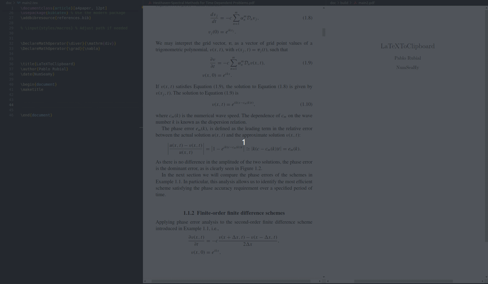
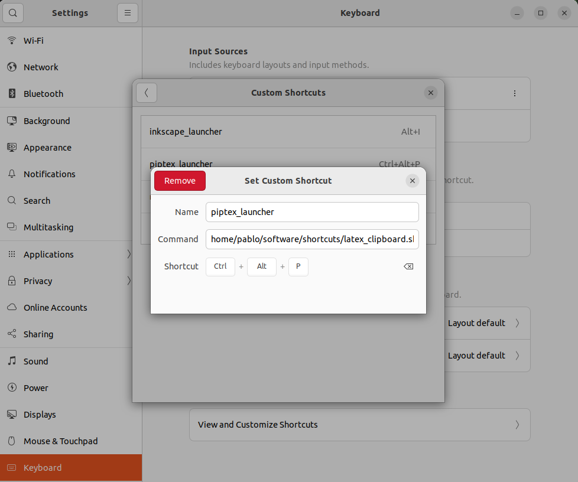

# LaTeXToClipboard

This script automates the process of a [Pix2Text](https://github.com/breezedeus/Pix2Text)-based script. It captures a screenshot, extracts LaTeX-formatted text from it, and copies the result to the clipboard. It offers an open-source alternative to proprietary tools like [Mathpix Snip](https://mathpix.com/snipping-tool). We refer to [Pix2Text](https://github.com/breezedeus/Pix2Text) for further details.



# Prerequisites
**gnome-screenshot** to make a screenshot. In case you have not installed it yet:
  ```bash
  sudo apt-get install gnome-screenshot
  ```
**xclip** for clipboard management. In case you have not installed it yet:
```bash
sudo apt-get install xclip
```
**awk** to extract content using regular exppressions from log files. In case you have not installed it yet:
```bash
sudo apt-get install gawk
```

# Setup

Clone this repository and locate it in a folder comfortable to the user. In my case I have chosen the following location:
```bash
mkdir $HOME/software
cd $HOME/software
git clone https://github.com/pablorubial/LaTeXToClipboard.git
```
Go to that folder and create there a Python virtual environment:
```bash
cd LaTeXToClipboard
python3 -m venv .myvenv
```
Activate the virtual environment:
```bash
source .myvenv/bin/activate
```

Install the packages from the requirements file:
```bash
pip install -r requirements.txt
```

With this setup, we can run the `Run.py` file, which takes an image from `$HOME/software/LaTeXTOClipboard/images/` and after applying a math recognition algorithm from [Pix2Text](https://github.com/breezedeus/Pix2Text), the output is displayed. Now, let us take advantage of this library and automatize the following process:

1. Take a screenshot of the desired formula in order to get its LaTeX expression.
2. Send that image to the `images` folder of this repository.
3. Run the `Run.py` file and save the output to a temporal file.
4. Extract the content between $$ symbols which contains the LaTeX expression.
5. Copy that expression to clipboard.

All these instructions can be written as a bash script (`.sh` file) inside a folder called `shortcuts` that is inside the `software` folder automating the process. So, let us generate the mentioned folder:

```bash
mkdir $HOME/software/shortcuts
cd $HOME/software/shortcuts
```

then create the following `.sh` file called, for example, `latex_clipboard.sh`, and put the following content inside:

```bash
#!/bin/bash
# Take the screenshot and send it to $HOME/software/LaTeXToClipboard/images/
gnome-screenshot -a -f $HOME/software/LaTeXToClipboard/images/test.jpg

# Process the image using pix2text and save the output in a temporal file
source $HOME/software/LaTeXToClipboard/.myenv/bin/activate
python3 $HOME/software/LaTeXToClipboard/src/Run.py |& tee /tmp/python_output.log
deactivate

# Extract all content between $$ and $$ and copy it to the clipboard
awk '/\$\$/ {flag=!flag; next} flag' /tmp/python_output.log | xclip -selection clipboard
```
Now, you have to make that file executable:
```bash
chmod +x $HOME/software/shortcuts/latex_clipboard.sh
```

Once the `.sh` file is executable, we can create a linux custom shortcut such that, whenenever it is executed, it runs the `.sh` file. In my case I linked the `.sh` file to the 'Ctrl' + 'Alt' + 'p' keyboard combination. This can be done as follows:

<div style="text-align: center;">
  
</div>


# Usage
Provide step-by-step instructions on how to use the latex_clipboard.sh script. This will help users understand how to effectively utilize your tool.

Example:

1. Activate the Shortcut:

  * Press the keyboard combination you assigned (e.g., Ctrl + Alt + P) to run the latex_clipboard.sh script.

2. Select the Desired Area:

  * Use the crosshair cursor to select the area of the screen containing the formula you wish to capture.
3. Paste the LaTeX Code:

  * The extracted LaTeX-formatted text is now copied to your clipboard.
  * Paste it into your LaTeX editor or document as needed.

# Contribution Guidelines

We welcome contributions of all kinds to enhance this project. To ensure a smooth collaboration, please follow these guidelines:

- **For Minor Changes**: Feel free to submit pull requests (PRs) for minor fixes, such as correcting typos, improving documentation, or small code enhancements.

- **For Major Changes**: If you plan to implement significant features, refactor code, or make changes that could impact existing functionality, please open an issue first. This allows us to discuss your proposal, provide feedback, and ensure alignment with the project's direction before substantial work is undertaken.

# Contact
Please, contact the project administrators,  [Pablo Rubial](mailto:pablorubialyanez@gmail.com),  [Davide Trevisani](mailto:davide.trevisani@udc.es), and [Oliver Rúas](mailto:ruas.barrosa.oliver@gmail.com) for further questions about licenses and terms of use.
